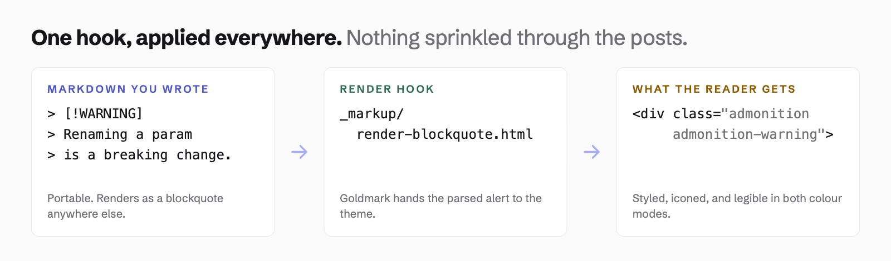

Everything on this page is either standard Markdown or a render hook that enriches it, so
the same files render fine anywhere, just plainer. Nothing here locks a post to this
theme, and that is deliberate: prefer these over a shortcode wherever both would work.

The theme does also ship [shortcodes]() for the things Markdown
cannot express. They are additive, and they carry a cost this page does not — read the
trade before reaching for one.

## Front matter

| Key | What it does |
|---|---|
| `title`, `description`, `date`, `draft`, `tags` | The standard set. `description` becomes the lede, the meta description, the card summary and the RSS description. |
| `lastmod` | Updated date. Shown only when `showDateUpdated` is on and this is later than `date`. |
| `showTableOfContents` | Per-post override of the site default. |
| `showHero` | Hide the cover on one post. |
| `heroStyle` | Per-post hero treatment: `basic`, `big`, `background`, `thumbAndBackground`. |
| `coverAlt` | Alt text for the cover. Empty by default, correct for artwork that repeats the title. |
| `robots` | `noindex, follow` and similar. Cascades, so setting it on a section covers everything under it. |
| `sitemap_exclude` | Keep a page out of `sitemap.xml`. |
| `excludeFromSearch` | Keep a page out of the ⌘K index. Separate from the above, because "do not index this" and "do not surface this in site search" are different intentions. |
| `externalUrl` | Point the listing entry at another site. |
| `editURL`, `editAppendPath` | Per-page override of the edit link. |
| `series`, `series_order` | Group a post into a multi-part series. See below. |
| `authors` | Credit several people, by key from `data/authors/`. Omit it and the post falls back to the site-wide author. |

## Hero styles

`heroStyle` picks how the cover is presented. Set it site-wide in
[Configuration]() or per post in front matter.

| Style | What it does |
|---|---|
| `basic` | A bordered card above the body. The default |
| `big` | The same, breaking out past the text measure |
| `background` | The cover behind the header, title over a scrim |
| `thumbAndBackground` | Both: behind the header, and again as a card |

**Every style keeps the cover whole.** The box is an exact 1200×630 ratio with
`object-fit: contain`, so a cover that is not 1200×630 letterboxes rather than losing its
edges. A background hero elsewhere fills an arbitrary band and crops to fit; this one does
not, because a cover with its title in the artwork loses the title to a crop.

**That constraint decides which artwork suits which style.** `background` and
`thumbAndBackground` put the title *on top of* the cover, so artwork that already carries
the title will show it twice. Use those two with textless artwork, and `basic` or `big`
with a cover that has words in it.

Below 720px the scrim would cover most of a short hero, so the header moves under the
image instead of over it and goes back to the normal text colours. A title that is
illegible is worse than a hero that is less dramatic.

**SVG covers work.** Hugo cannot resize an SVG or read its pixel dimensions, so the theme
skips both for vector covers and lets CSS hold the box instead.

## Series

A post that is part of a longer piece gets a navigation block above its body: which part
this is, how many there are, and a link to each of the others. The post you are reading
is not in one; [any of the three "Design decisions" posts]()
shows it live.

```yaml
series: ["Design decisions"]
series_order: 2
```

**Register the taxonomy first.** Nothing renders without it, because Hugo builds no term
pages to link to:

```toml
[taxonomies]
  tag = "tags"
  series = "series"
```

**`series_order` decides the order, and it is not optional.** Hugo has nothing else to
sort on, and a series listed in an arbitrary order is worse than no series block at all —
so a post in a series without one **fails the build** rather than rendering a scrambled
list. The order is independent of date, which is the point: a series can be written out
of sequence, or an earlier part revised later, without the navigation changing.

The block is a `<details>`, so it needs no JavaScript and collapses on its own.
`article.seriesOpened` sets whether it starts expanded; collapsed is the default, since
the summary line already says which part you are on and a reader who arrived at part 3 did
not come for the table of contents. The current part is plain text rather than a link,
carrying `aria-current="page"` — a link to the page you are already on is a dead end.

A series with only one post in it renders nothing. That is not a series yet.

## Maths

Equations are rendered **at build time**, so the theme ships no maths library: no
JavaScript, no stylesheet, and none of the font files a client-side renderer needs. The
equation is in the HTML the server sends, which means it is there with scripting off, in a
feed reader, and anywhere else that reads the page without executing it.

Inline maths uses `\(` and `\)`:

The quadratic formula is \(x = \frac{-b \pm \sqrt{b^2 - 4ac}}{2a}\), which every schoolchild
is made to memorise.

Display maths uses `$$`:

$$
\sum_{i=1}^{n} i = \frac{n(n+1)}{2}
$$

**Turn it on in your own config**, because Goldmark has to be told to hand the delimiters
through untouched. This is site config rather than a theme setting, and a site that wants
no maths configures nothing and pays nothing:

```toml
[markup.goldmark.extensions.passthrough]
  enable = true
  [markup.goldmark.extensions.passthrough.delimiters]
    block  = [["\\[", "\\]"], ["$$", "$$"]]
    inline = [["\\(", "\\)"]]
```

Output is MathML, which browsers lay out natively. Hugo can also emit KaTeX's own HTML
alongside it, but that needs KaTeX's stylesheet and around sixty font files to look right —
the exact weight this approach avoids.

A malformed expression **fails the build** rather than rendering as its own raw LaTeX,
which is the kind of thing an author notices weeks later.

## Admonitions

Callouts use GitHub's alert syntax. Paste any of these into a GitHub README and they
render as ordinary blockquotes: quieter, but never broken.

```markdown
> [!WARNING]
> Renaming a published config key is a breaking change.
```

All five, live:

> [!NOTE]
> Useful information a reader should notice even when skimming.

> [!TIP]
> Optional, but it will make something easier.

> [!IMPORTANT]
> Necessary to succeed. Not optional.

> [!WARNING]
> Needs immediate attention because of the risk it carries.

> [!CAUTION]
> Consequences of getting it wrong.

Their colours sit outside the palette system, because a caution should read as a caution
whether the site runs periwinkle, sage or clay. Every label and body colour is measured
at 4.5:1 or better against its own tinted background in both modes.

An unrecognised type emits a build warning and falls back to a plain blockquote, so a
typo surfaces at build time rather than in production.

A plain blockquote still looks like a plain blockquote:

> The theme replaces a larger one. An audit found roughly two thirds of that theme
> unused by the site it served, which is the whole reason this one exists.

## Images

Write an ordinary Markdown image. Local images get intrinsic width and height so the
article never reflows as they load, a `srcset` capped at the original, and lazy loading.

```markdown

```

The quoted title becomes a caption. Captions need
`wrapStandAloneImageWithinParagraph = false` and only apply to an image alone in its own
paragraph, because a `<figure>` inside a `<p>` is invalid HTML.

### Dark variants

Drop `diagram-dark.png` beside `diagram.png` and it is used whenever the dark palette is
active. Toggle the appearance control in the header and watch the diagram below change:



It is two `` elements and CSS rather than a `<picture>` element with a
`prefers-color-scheme` source. A media query only knows what the operating system wants,
and this theme lets a reader override that, so `<picture>` would show the wrong artwork
to exactly the readers who cared enough to choose.

Remote URLs and anything in `static/` pass through with lazy loading and nothing else.
Hugo cannot measure a file it does not manage, and a made-up width is worse than none.
SVG and GIF skip resizing too: SVG has no raster size, and a resized GIF stops animating.

## Code

Fences work as normal. Add `{file="..."}` and the block grows a filename bar:

````markdown
```go {file="main.go"}
func main() {}
```
````

Which renders as:

```go {file="main.go"}
package main

import "fmt"

// Every Chroma token class is styled for both colour modes. Comments in
// particular are measured, because they are the first thing to fail contrast.
func main() {
	things := map[string]int{"alpha": 1, "beta": 2}
	for name, count := range things {
		fmt.Printf("%s = %d\n", name, count)
	}
}
```

```yaml {file="docker-compose.yml"}
services:
  web:
    image: nginx:1.27-alpine
    ports:
      - "8080:80"
    environment:
      TZ: Europe/Oslo
```

All 84 Chroma token classes are styled for light and dark, and every one is verified at
4.5:1 or better against the code background.

## Tables

Wide tables scroll inside their own container rather than pushing the page sideways. The
container is focusable, because a scrollable region that cannot be focused is
unreachable without a mouse.

| Component | Degrades to | Needs JavaScript |
|---|---|---|
| Table of contents | A plain list of working links | For scroll-spy only |
| Code copy | Selectable code | Yes |
| Appearance toggle | Follows `prefers-color-scheme` | For the override only |
| Search | Nothing. It disappears. | Yes |
| Reading progress | Nothing | Yes |

## Embedded media

Raw HTML never passes through a render hook, so embeds are handled in CSS instead. A
pasted embed carrying `width="1200"` is contained rather than allowed to break the
layout on a phone.

<iframe srcdoc="<div style='font:15px system-ui;display:grid;place-items:center;height:100%;color:#666'>An embedded frame, contained at 16/9</div>" title="An example embed" width="1200" height="675"></iframe>

`iframe` elements have no intrinsic aspect ratio, so 16/9 is assumed because video is
what people actually embed. Anything else overrides it inline:

```html
<iframe src="..." style="aspect-ratio: 4/3"></iframe>
```

## Footnotes

Standard Markdown footnotes work and are linked in both directions.[^1]

[^1]: Which is the point. Nothing here is theme-specific syntax.
